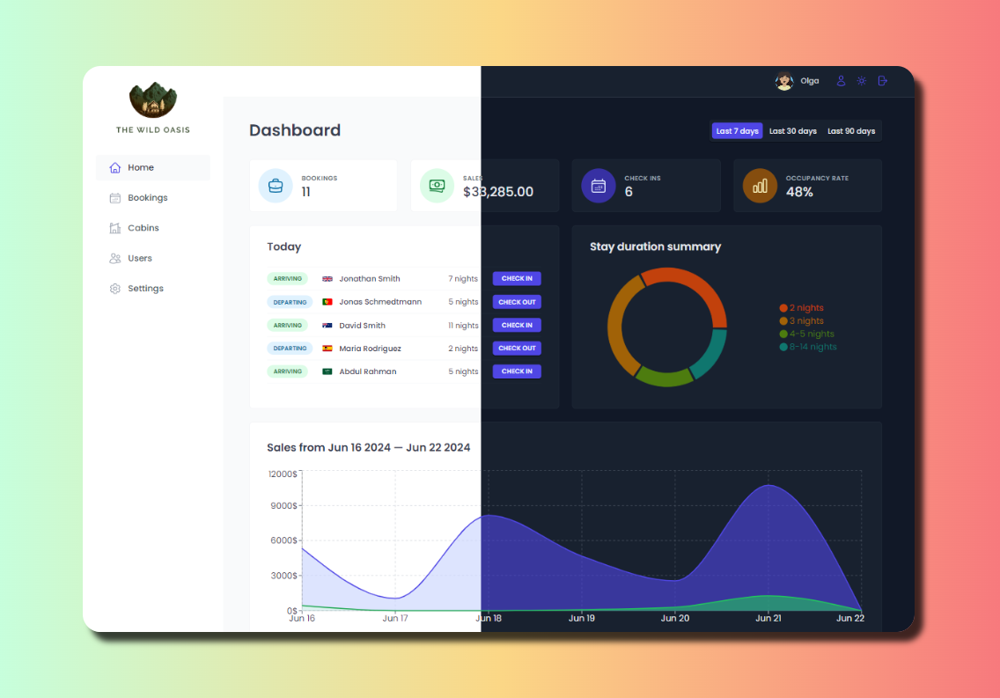

<div align="center">

  

  <h2>The Wild Oasis</h2>

  <h3>
    <a href="https://the-wild-oasis-olga.vercel.app">
      <strong>Demo Website</strong>
    </a>
  </h3>
 


 <hr>


<p>The Wild Oasis hotel management app is a full-featured React web application that allows hotel staff to manage cabins, bookings and guests. The application uses Supabase for the backend and implements several advanced React techniques such as HOCs, Compound Component Pattern and React Query.</p>

<a align="center" href="https://the-wild-oasis-olga.vercel.app">



</a>

</div>

## Features

- Registering new users within the application
- Changing user data: changing name and password, uploading avatar
- Table with all cabins, which includes cabin photo, name, capacity, price and current discount.
- Adding, modifying and deleting cabins
- Table of all bookings with the following fields: check-in and check-out dates, status, payment amount, cabin and guest details
- 3 booking statuses: unconfirmed (booked but not checked in), checked in and checked out
- Other booking data: number of guests, number of nights, guest observations, whether they have booked breakfast, breakfast price
- Checking in guests on arrival, checking out and deleting reservations
- Adding extras (breakfast) as well as confirmation of payment
- Guest data includes: full name, email, national ID, citizenship and country flag for easy identification.
- Filtering and sorting cabin and booking data
- Start screen with important information for the last 7, 30 or 90 days
- List of guests checking in and checking out on the current day. Ability to check-in and check-out on click
- Statistics on recent bookings, sales, check-ins and occupancy rates
- Hotel sales chart (total sales and additional sales (breakfast))
- Chart of length of stay statistics
- Change general settings: breakfast price, minimum and maximum number of nights, maximum number of guests.
- Dark mode

## How to run locally

- Install dependencies:

```js
npm install
```

- Start local server via Vite

```js
npm run dev
```
